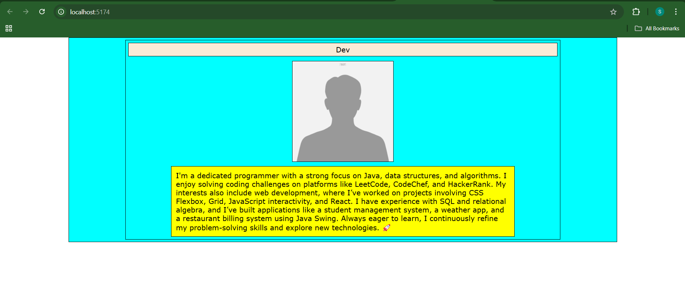
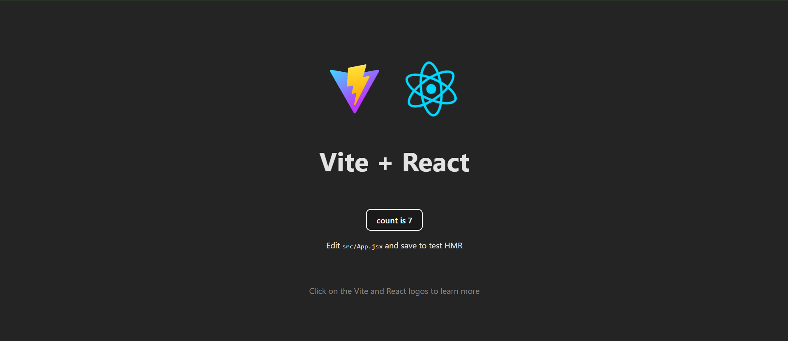

# React + Vite

This template provides a minimal setup to get React working in Vite with HMR and some ESLint rules.

Currently, two official plugins are available:

- [@vitejs/plugin-react](https://github.com/vitejs/vite-plugin-react/blob/main/packages/plugin-react/README.md) uses [Babel](https://babeljs.io/) for Fast Refresh
- [@vitejs/plugin-react-swc](https://github.com/vitejs/vite-plugin-react-swc) uses [SWC](https://swc.rs/) for Fast Refresh

- Output for the props part

- Output for the counter part


## 📦 Install Dependencies:
Install the required packages and set up your React project using Vite:
```bash
npm create vite@latest my-react-app --template react
cd my-react-app
npm install
npm run dev
```

---

## 🔐 Environment Setup:
Set up your project environment by creating a React project with Vite, which offers a fast development environment and efficient bundling.

---

## 💻 Project: Personal Profile Card
### 🎯 Objective:
Learn the basics of React by building reusable components and passing data using props.

### ✅ Tasks:
1. **Set Up a React Project Using Vite:**
   - Follow the steps above to initialize your React project.
2. **Create a Functional Component for a Profile Card:**
   - Create a new component file (e.g., `ProfileCard.jsx`).
3. **Use Props to Display User Data:**
   - In your `ProfileCard` component, accept props for `name`, `photo`, and `bio` and render them appropriately.
4. **Style the Card Using Basic CSS:**
   - Create a CSS file (e.g., `ProfileCard.css`) and import it in your component to apply styles.

---

## 🌐 Project: Simple Counter App
### 🎯 Objective:
Understand how to manage and update state dynamically in a React application using the `useState` hook.

### ✅ Tasks:
1. **Create a Functional Component for the Counter:**
   - Create a new component file (e.g., `CounterApp.jsx`).
2. **Implement State Management with `useState`:**
   - Initialize a state variable for the counter using the `useState` hook.
3. **Add Event Handling for Counter Operations:**
   - Implement buttons to increment, decrement, and reset the counter.
   - Update the counter value dynamically on user interaction.
4. **Display the Counter Value:**
   - Render the current counter value within your component to reflect state changes.

---

## 🔥 Conclusion
This README covers:
- Setting up a React project with Vite.
- Building a Personal Profile Card using functional components and props.
- Creating a Simple Counter App with state management using the `useState` hook.


